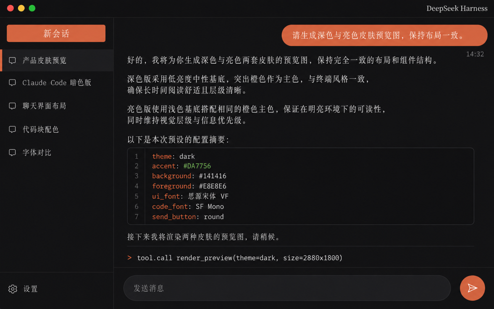

# dsh-skin-claude-code

DeepSeek Harness (dsh) Web GUI 皮肤插件：Claude Code 风格界面 + Codex 暖光配色。
配色与字体配置取自 Codex 主题（codex-theme-v1）：陶土橙 #DA7756、奶油纸面 #F5F3EE、
暖黑正文 #1D1B16、UI 字体思源宋体 VF、代码字体 SF Mono，配终端窗口式标题栏，支持亮/暗双模式。

## 预览

| 亮色 | 暗色 |
| --- | --- |
|  |  |

## 安装

    dsh plugin --profile web add https://github.com/le-soleil-se-couche/dsh-skin-claude-code
    dsh web

启用后刷新页面即生效；皮肤互斥与切换由 dsh-web-ui 全家桶的 scripts/dsh-skin 管理，
或直接编辑 ~/.dsh/cordis.patch.yml。

## 开发

    npm install
    npm test
    npm run build

皮肤只依赖官方 NPM SDK（@deepseek-ai/cordis），不修改 DSH 源码；样式作用域限定在
body[data-dsh-claude-code]（暗色变体 body[data-dsh-claude-code][data-ds-dark-theme]），
apply() 的全部写入在 dispose 时完整收回。
