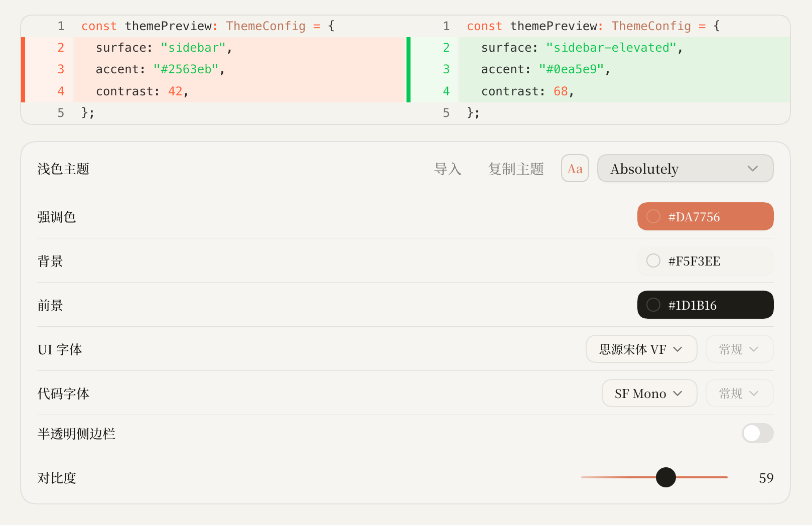
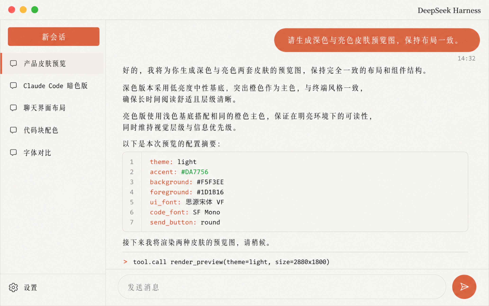

# dsh-skin-claude-code

完美复刻 Claude Code 皮肤，纪念我的 Vibe Coding 白月光。

DeepSeek Harness (dsh) Web GUI 皮肤插件：配色与字体配置取自 Codex 主题（codex-theme-v1）——
陶土橙 #DA7756、奶油纸面 #F5F3EE、暖黑正文 #1D1B16、UI 字体思源宋体 VF、代码字体 SF Mono，
配终端窗口式标题栏，支持亮/暗双模式。

## 展示

配色与字体配置（Codex · codex-theme-v1）：

    codex-theme-v1: {"codeThemeId":"absolutely","theme":{"accent":"#da7756","contrast":59,"fonts":{"code":"SF Mono","ui":"思源宋体 VF"},"ink":"#1d1b16","opaqueWindows":true,"semanticColors":{"diffAdded":"#00c853","diffRemoved":"#ff5f38","skill":"#cc7d5e"},"surface":"#f5f3ee"},"variant":"light"}

界面效果：

## 安装

    dsh plugin --profile web add https://github.com/le-soleil-se-couche/dsh-skin-claude-code
    dsh web

启用后刷新页面即生效；皮肤互斥与切换由 dsh-web-ui 全家桶的 scripts/dsh-skin 管理，
或直接编辑 ~/.dsh/cordis.patch.yml。

## 开发

    npm install
    npm test
    npm run build

皮肤只依赖官方 NPM SDK（@deepseek-ai/cordis），不修改 DSH 源码；样式作用域限定在
body[data-dsh-claude-code]（暗色变体 body[data-dsh-claude-code][data-ds-dark-theme]），
apply() 的全部写入在 dispose 时完整收回。
